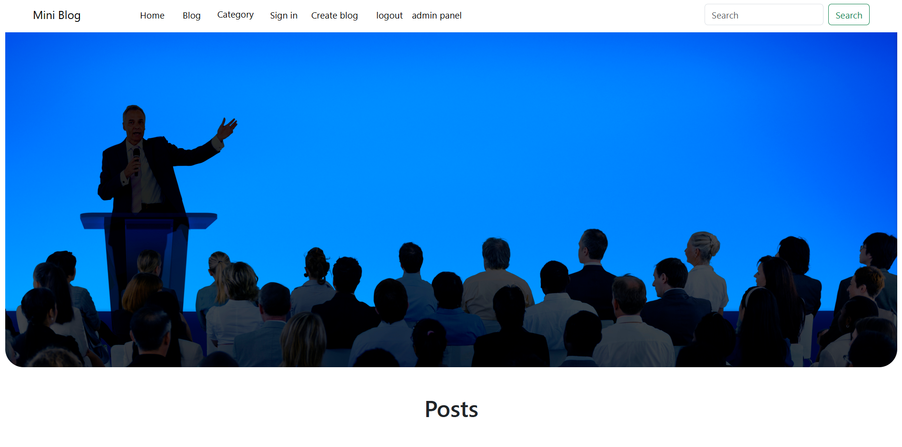
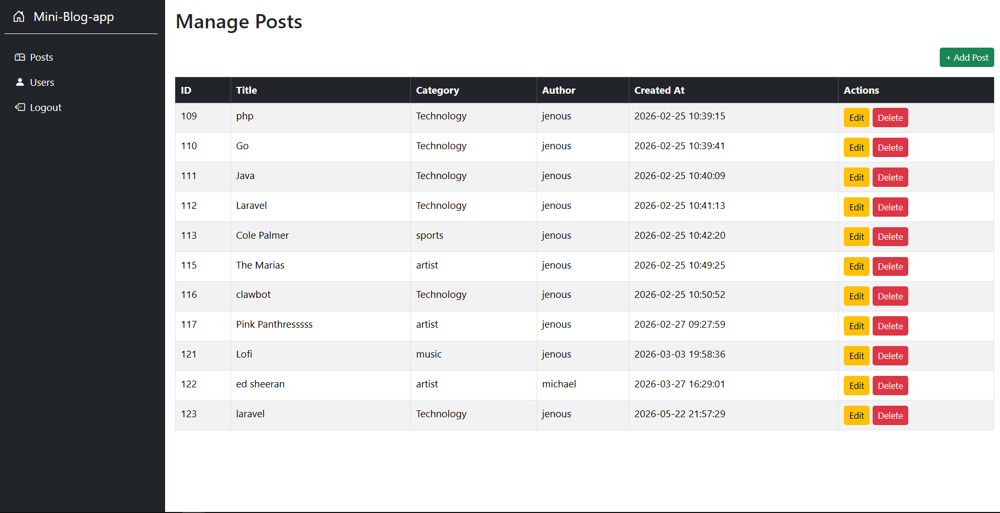
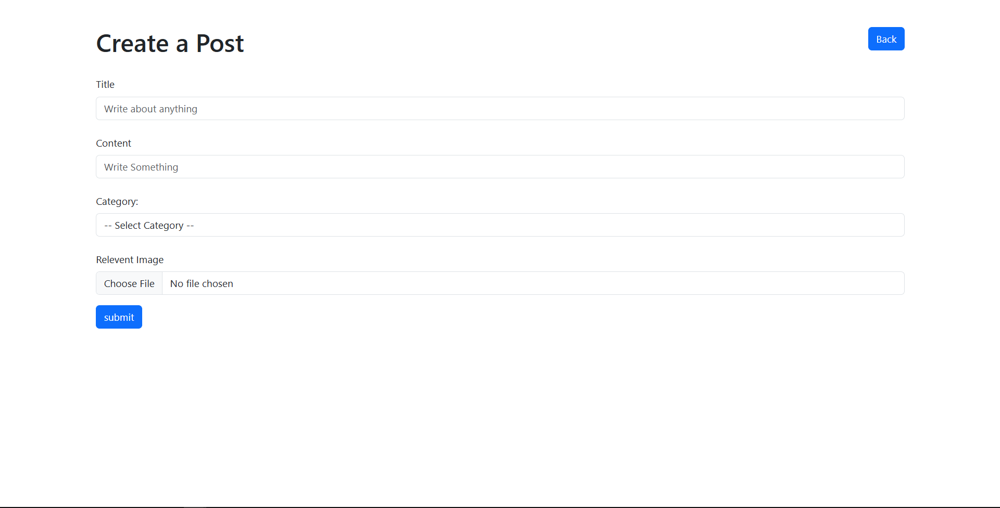
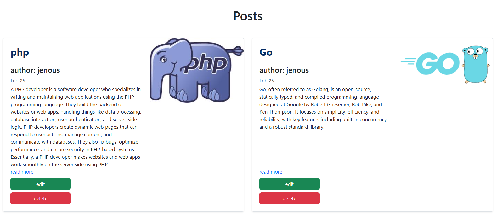
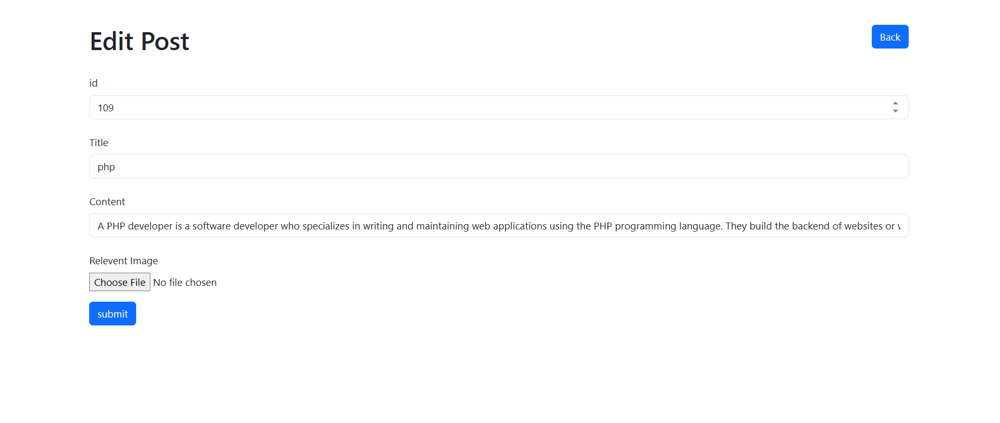
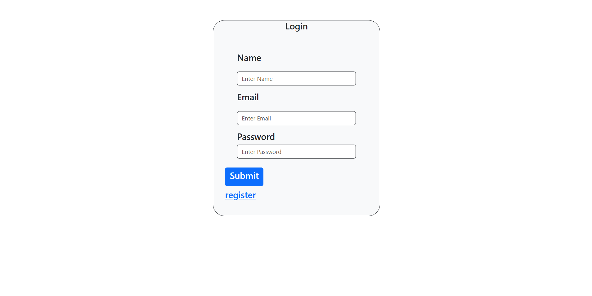

# Mini Blog App

A simple PHP & MySQL based mini blogging application built using core PHP, OOP, Bootstrap 5, and MySQL.

## Home Page

## Admin Panel

## Create Post Page

## Posts

## Edit Post

## Login Page


## 🚀 Features

- User Registration & Login
- Session Authentication
- Create Blog Posts
- Edit Posts
- Delete Posts
- Upload Images
- Admin Panel UI
- Responsive Bootstrap Design
- MySQL Database Integration
- Secure Password Hashing
- PDO Database Connection
- Protected Routes using Auth Guard

---

## 🛠 Technologies Used

- PHP (OOP)
- MySQL
- Bootstrap 5
- HTML5
- CSS3
- Composer
- PHP Dotenv

---
## ⚙️ Installation

### 1. Clone Repository
```bash
git clone https://github.com/yourusername/mini-blog-app.git
```

### 2. Move Project to XAMPP htdocs

Example:
```bash
D:/xampp/htdocs/Mini-Blog-app
```

---

### 3. Install Dependencies
```bash
composer install
 ```
---

### 4. Create MySQL Database
Open MySQL terminal:
```bash
mysql -u root -p
```

```bash
CREATE DATABASE mini_blog
CHARACTER SET utf8mb4
COLLATE utf8mb4_unicode_ci;
```
--- 

### 5. 🗄 Database Tables
Users Table
```sql
CREATE TABLE users (
    id INT AUTO_INCREMENT PRIMARY KEY,
    name VARCHAR(100) NOT NULL,
    email VARCHAR(150) UNIQUE NOT NULL,
    password VARCHAR(255) NOT NULL,
    created_at TIMESTAMP DEFAULT CURRENT_TIMESTAMP
);
```

### Posts Table
```sql
CREATE TABLE posts (
    id INT AUTO_INCREMENT PRIMARY KEY,
    user_id INT NOT NULL,
    title VARCHAR(255) NOT NULL,
    content TEXT NOT NULL,
    image VARCHAR(255),
    created_at TIMESTAMP DEFAULT CURRENT_TIMESTAMP,
    
    FOREIGN KEY (user_id)
    REFERENCES users(id)
    ON DELETE CASCADE
);
```

---

## 🔐 Environment Variables

### Create a .env file:
```bash
DB_HOST=127.0.0.1
DB_PORT=3306
DB_NAME=mini_blog
DB_USER=root
DB_PASS=yourpassword
```
 ---

## ▶️ Run Project

Start:
```bash
Apache
MySQL
```
Open browser:
```bash
http://localhost/Mini-Blog-app/public
```
---

## 📸 Features Preview
- User Authentication
- Register
- Login
- Logout
- Blog System
- Create Posts
- Edit Posts
- Delete Posts
- Upload Images
- Admin Dashboard
- Sidebar Layout
- Dashboard Cards
- Post Management

---

## 🔒 Security Features
- Password Hashing
- Prepared Statements (PDO)
- Session Authentication
- Auth Guard Protection
- Escaped Output using htmlspecialchars()

---  

## 📂 Project Structure

```bash
Mini-Blog-app/
│
├── actions/
├── auth/
├── includes/
├── public/
├── src/
├── uploads/
├── vendor/
├── .env
├── composer.json
└── README.md
```
